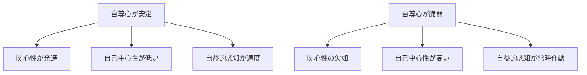

# 満たされない自己愛：大渕憲一

**著者:** 大渕憲一

## はじめに

大渕憲一の『満たされない自己愛』は、現代社会における自己愛病理の問題を心理学的に分析した重要な著作です。本書では、対象関係論、自尊心の階層モデル、そして自己愛病理のメカニズムを詳細に解説しています。

---

## 1. 対象関係論：2つの立場

対象関係論は、自己愛病理を理解するための重要な理論的枠組みです。主に2つの立場があります。

### コフートの立場

**原因：** 承認の不足と信頼できる関係の不足

```
承認の不足
信頼できる関係の不足
    ↓
不完全な内在化
    ↓
「他人が私を支える」
承認欲求の肥大化
```

**治療アプローチ：**
> 傷つきやすい自己を壊さないことが最優先

---

### カーンバーグの立場

**原因：** 良い自己と悪い自己の分裂

**治療アプローチへの警告：**
> 理想化に迎合すると病理が固定化される危険

---

### コフート的解釈：内面と外見のギャップ

**前提となる人の状態：**

| 側面 | 状態 |
|------|------|
| **内面** | 恥、空虚、無力感 |
| **外見** | 自慢、誇張、承認欲求 |

**典型的なパターン：**

> 「僕はすごいんだ！」と言いながら、内心その存在の支えがなくならないか不安で仕方がない

理想化が崩れると内的欲求が噴出する

---

### カーンバーグ的解釈：対象の二分化

**特徴：** 対象が自己と他者で2分している

```
理想化 / 貶め
```

**典型的な言動：**
> 「あなたはほかの無能な人間とは違う」

他者を極端に理想化するか、貶めるかのどちらかになる

---

## 2. 自尊心の階層モデル：マズローと大渕の対比

### マズローの欲求階層説

```
        自己実現
            ↑
         承認欲求
            ↑
        所属欲求
            ↑
        安全欲求
            ↑
        生理欲求
```

**特徴：** 直線的・段階的

下の欲求が満たされると、上の欲求に進む

---

### 大渕の心理的階層

```
      行動・達成
────────────────
     承認・比較
────────────────
  自尊心（常時作動）
────────────────
 生理・身体的安定
```

**特徴：** 基盤が全体を支える

自尊心は常時作動するベースであり、段階的に「達成」するものではない

---

### 両者の決定的な違い

**マズローの問題点：**
> 基盤が形成されないまま上に登らされる → 上に登れない

**大渕の洞察：**
自尊心という基盤がないまま、社会的成功や承認を求めても、根本的な解決にならない

---

## 3. 自己愛病理のメカニズム

### なぜ社会適応者にも自己愛病理が起きるのか

**この理論で見ると：**

社会的成功、高学歴、高収入は、**自尊心の代替にはならない**

むしろ：

```
自尊心が欠けたまま
    ↓
社会的成功で補おうとする
    ↓
自己愛的防衛が肥大化する
```

**逆説：**
成功すればするほど、自己愛病理が悪化する可能性がある

---

## 4. 主要概念の整理

### 自尊心（Self-Esteem）

> 「自分は価値ある存在であり、特別な成果がなくても存在してよい」という基盤的確信

**対象関係論的理解：**
良い自己―良い対象関係が安定して内在化されている状態

**重要性：**
- 心理的健康の基盤
- すべての活動のベース
- 常時作動している

---

### 関心性（Concern）

> 他者や世界に心が向かう余白

**前提条件：**
自分の価値を守ることに心的エネルギーを使わずに済むため、他者や世界へ注意を向けられる能力

**意味：**
自尊心が安定していると、他者への genuine な関心が持てる

---

### 自己中心性（Egocentrism）

> 防衛としての自己への固着

**見かけ：**
- 話題が自分に戻る
- 批判に過敏
- 他者の都合が視界に入りにくい

**内実（真の原因）：**
- 自尊心が脆弱
- 常に自己評価を維持・回復する必要がある
- 他者は「関係する存在」ではなく「自己を脅かす／支える要因」

**重要な理解：**
自己中心性は「性格の悪さ」ではなく、**防衛メカニズム**である

---

### 自益的認知（Self-Serving Cognition）

> 心を守るための歪み

**定義：**
出来事を「自分の価値が下がらない形」に無意識に再解釈する認知様式

**典型例：**

| 出来事 | 解釈 |
|--------|------|
| **成功** | 自分の能力 |
| **失敗** | 環境・他者のせい |
| **批判** | 嫉妬・誤解と解釈 |

---

### 病理ではない点

**重要な理解：**
> 誰にでもある

自益的認知自体は、適応的な防衛メカニズムとして誰もが持っている

**問題は：** 常時作動するかどうか

健康な人：時々使う
病理的な人：常に使う（他の解釈ができない）

---

## 5. 4つの概念の関係



**健康な状態：**
- 自尊心が安定 → 他者への関心が持てる
- 防衛が適度 → 柔軟な思考が可能

**病理的な状態：**
- 自尊心が脆弱 → 自己防衛に専念
- 防衛が過剰 → 認知が歪む

---

## まとめ

大渕憲一の理論は、自己愛病理を理解するための包括的なフレームワークを提供します。

**重要なポイント：**

1. **自尊心は基盤である**
   - マズローの階層説とは異なり、自尊心は「達成」するものではなく「ベース」
   - 基盤なしに上に積み上げても、不安定になる

2. **社会的成功は自尊心の代替にならない**
   - むしろ、自尊心の欠如を隠蔽し、病理を悪化させる可能性がある

3. **自己中心性は防衛メカニズム**
   - 「性格が悪い」のではなく、心を守るための戦略
   - 根本原因は自尊心の脆弱さ

4. **誰にでもある要素**
   - 自益的認知など、防衛メカニズムは誰もが持っている
   - 問題は程度と頻度

**実践的示唆：**

自己愛病理への対処は、社会的成功を追求することではなく、基盤となる自尊心を育てることが重要です。コフートとカーンバーグの両方のアプローチを理解し、状況に応じた適切な対応が求められます。
