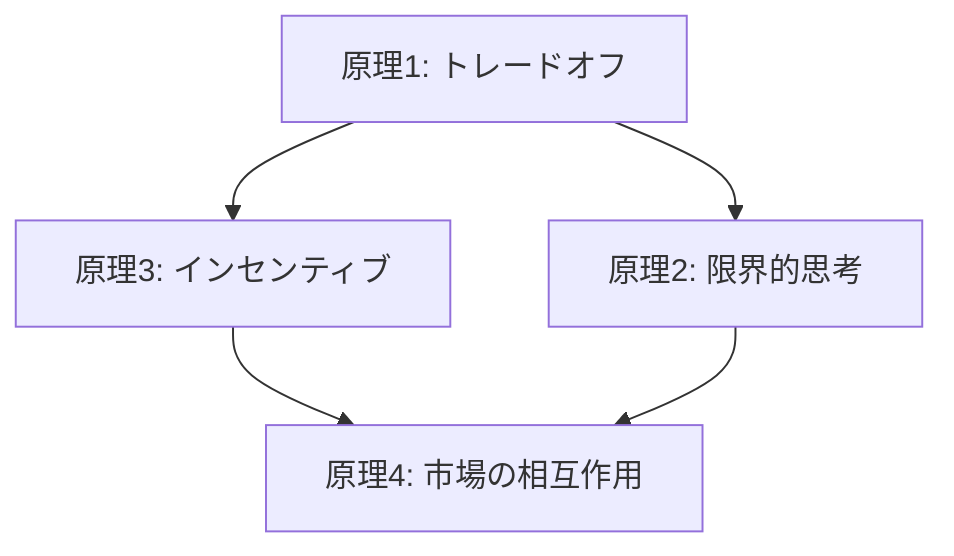

# クルーグマン：マクロ経済学

**著者:** ポール・クルーグマン

## はじめに

ポール・クルーグマンのマクロ経済学は、経済学的思考の基礎となる原理を明確に提示しています。本ノートでは、特にミクロ経済学の4つの基本原理に焦点を当て、それぞれの概念を深く理解していきます。

---

## ミクロ経済学の4つの個人の選択原理

### 原理1：トレードオフが存在する

**核心的概念：**
資源は有限だから、すべての選択には犠牲が伴う

**機会費用の定義：**
> それを得るために諦めなければならないものの価値

選択とは常に何かを選び、何かを諦めることです。経済学では、この「諦めたもの」の価値を**機会費用**と呼びます。

**重要性：**
- 経済学的思考の基盤
- すべての意思決定は何らかのトレードオフを含む
- 「無料」は存在しない（時間や機会も資源）

---

### 原理2：限界的思考

**定義：**
> あと1単位増やすのにどれだけコストがかかるか

追加で1単位選んだ時に何を失うか、を考える思考法

**原理1との関係：**
```
原理1（トレードオフ）▶ 原理2（限界的思考）
```

この順序は、トレードオフの概念をより深掘りする流れです：

```
資源は有限
↓
だから選択には犠牲がある
↓
その犠牲を測る概念が機会費用
↓
判断は**限界**単位で行われる
```

---

### 限界的思考と機会費用の統合

**限界で考えるとは：**

> 機会費用は、ある選択を「1単位増やした」ことで失われる、次善の選択の価値です。

**具体例：**

勉強時間を1時間増やす
→ 失われるのは「その1時間でできた最善の別行動」

**数学的理解：**
> 関数の微分

限界的思考は本質的に微分の概念と同じです。総費用・総便益ではなく、**追加の**費用・便益に注目します。

**適用場面：**
- 追加投資の判断
- 在庫管理
- 時間配分の最適化
- 価格設定戦略

---

### 原理3：人はインセンティブに反応する

**核心：**
人々の行動は、報酬と罰（インセンティブ）によって変化する

**意味：**
- 経済政策はインセンティブ設計が重要
- 価格メカニズムは強力なインセンティブ
- 意図しない結果は、インセンティブ設計の失敗から生じる

**応用：**
- 税制設計
- 環境政策（炭素税など）
- 企業の報酬制度

---

### 原理4：相互作用が市場を作る

**核心：**
個々の選択が相互作用することで、市場という調整メカニズムが生まれる

**市場の機能：**
- 分散した知識を価格に集約
- 需要と供給を調整
- 資源を効率的に配分

**重要な洞察：**
- 市場は「誰か」が設計するのではなく、相互作用から自然発生する
- 価格は情報伝達の手段
- 取引は両者に利益をもたらす（win-win）

---

## 4つの原理の関係



**統合的理解：**

1. **資源は有限**（原理1）だから
2. **限界的に最適化**（原理2）する必要があり
3. **インセンティブに反応**（原理3）して行動し
4. その結果が**市場で相互作用**（原理4）する

この4つの原理は、ミクロ経済学の基礎であり、すべての経済分析の出発点となります。

---

## マクロ経済学

（本セクションは今後追加予定）

マクロ経済学では、これらのミクロの原理が国家経済全体のレベルでどのように機能するかを探求します。

**主要トピック（予定）:**
- GDP（国内総生産）
- インフレーション
- 失業
- 財政政策と金融政策
- 国際貿易

---

## まとめ

クルーグマンのミクロ経済学の4原理は、経済学的思考の基礎を提供します。

**重要なポイント：**
1. すべての選択にはトレードオフがある
2. 意思決定は限界（追加単位）で行う
3. インセンティブが行動を駆動する
4. 個々の行動が市場で相互作用する

これらの原理を理解することで、日常生活からビジネス、政策まで、あらゆる経済的意思決定をより深く分析できるようになります。
